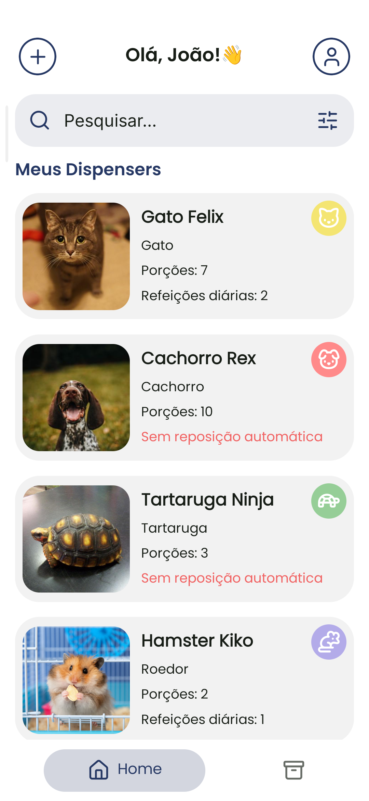
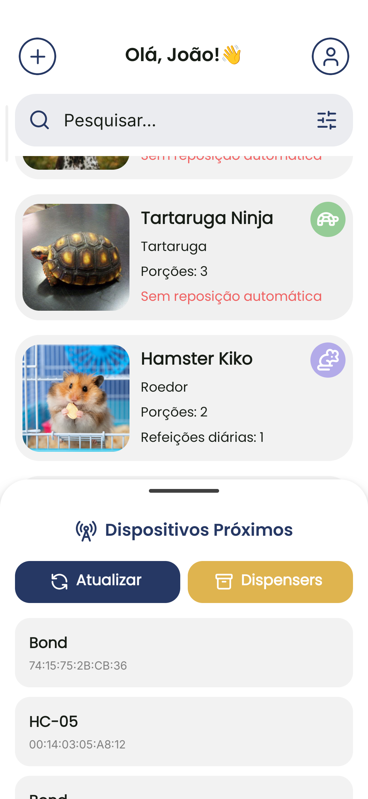
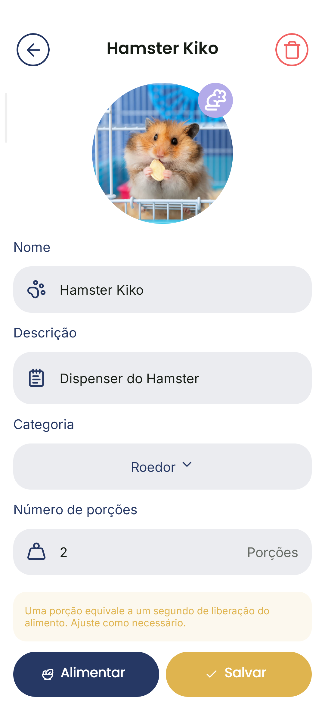
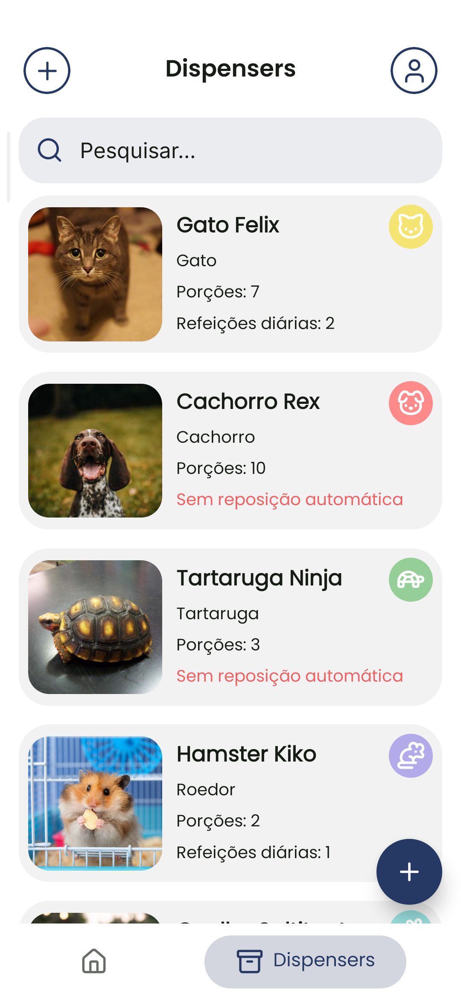

# Bond

O Bond, em homenagem ao adorável cão da família Forger no anime e mangá Spy x Family, é um projeto focado na integração entre dispositivos móveis e sistemas de Internet das Coisas (IoT), desenvolvido para facilitar a alimentação de pets de forma prática e eficiente. 

O foco central deste sistema é a comunicação via Bluetooth entre smartphones Android e módulos embarcados, permitindo o controle de dispositivos reaponsáveis por dispensar a comida de forma centralizada e intuitiva.

## Screenshots

<table align="center">
  <tr>
    <td></td>
    <td></td>
  </tr>
  <tr>
    <td></td>
    <td></td>
  </tr>
</table>

## Vídeo de Demonstração

https://github.com/user-attachments/assets/f00a8447-f60d-4bce-b795-5b8accd6545b

## Funcionalidades

* **Descoberta de dispositivos:** Escaneamento de hardware compatível disponível nas proximidades via protocolo Bluetooth.
* **Pareamento e conexão:** Gerenciamento de conexões persistentes para controle de dispositivos em tempo real.
* **Interface de controle:** Cards dedicados para cada dispositivo pareado, permitindo o envio de comandos e a configuração de automações.
* **Persistência local:** Armazenamento das configurações de cada dispositivo, garantindo que as preferências sejam mantidas mesmo após o fechamento do aplicativo.

## Tecnologias

* **Front-end:** React Native com Expo, utilizando TypeScript.
* **Comunicação:** Implementação de protocolo de comunicação Bluetooth para troca de mensagens com o hardware.
* **Persistência:** Uso de AsyncStorage para gerenciamento local de estados e dados dos dispositivos configurados.
* **Interface:** Componentes customizados focados em usabilidade, com suporte a fluxos dinâmicos de pareamento.

## Estrutura do Projeto

O sistema foi estruturado para ser modular, separando a camada de comunicação Bluetooth da lógica de apresentação. A interface de usuário é baseada em um fluxo de descoberta, pareamento e controle detalhado por dispositivo.

## Como utilizar

Para rodar o projeto localmente:

1. Clone este repositório.
2. Instale as dependências com `npm install`.
3. Certifique-se de que o ambiente de desenvolvimento Android esteja configurado.
4. Execute o projeto via `npx expo run:android`.

*Nota: O projeto faz uso de módulos nativos para a comunicação Bluetooth, sendo necessário um ambiente compatível com Android para realizar a conexão real com o hardware.*
